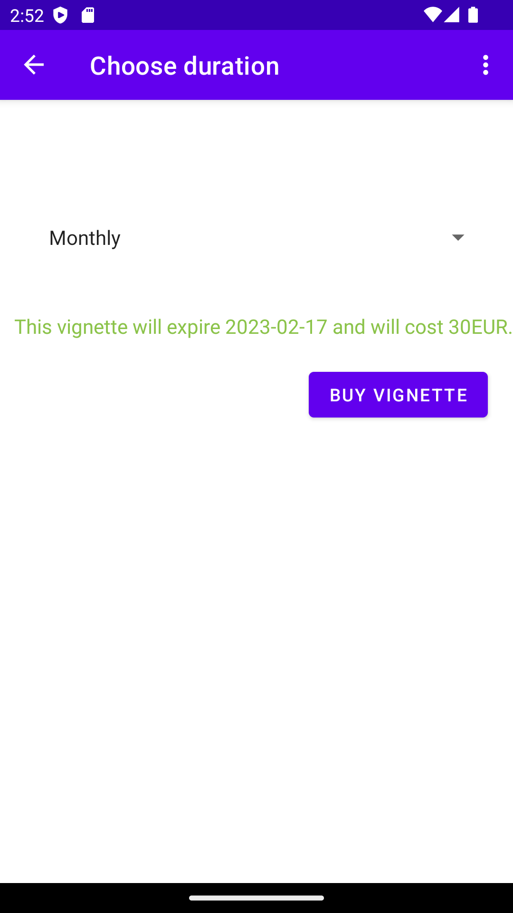

### Description

Project name: mVignette

63170342 Filip Opačić

mVignette is an app that helps users track and manage their vehicles' highway vignette status.
Users can register their vehicles of all supported types, purchase vignettes 
for them, see the vignettes' status, organize vehicles into fleets and share fleets with other users (family, coworkers, ...).

The source code to the app is published on GitHub: [mVignette on GitHub](https://github.com/FilipO11/mVignetteAppv2)

The application uses the REST API to communicate with the mVignette database, hosted on Azure. Using the API it can manipulate data as
described in the Swagger documentation found here:
[mVignette Swagger](https://mvignette.azurewebsites.net/swagger/)

### Details

On the home screen, the user is shown all their fleets. They can click to view an individual fleet or create a new one.

To create a new fleet, the user is prompted to enter its name. It cannot be empty. 
The fleet is submitted via POST:/api/v1/Fleet

On the fleet details view, all the vehicles in the fleet are displayed. The user can click to view an individual vehicle or 
add a new one to the fleet.
Vehicles with valid vignettes are colored green.

To create a new vehicle, the user is prompted to enter its name and registration plate. It cannot be empty.
The user also chooses the type of the vehicle.
The vehicle is submitted via POST:/api/v1/Vehicle

On the vehicle details view, the vehicle's attributes are displayed.
If the vehicle has no valid vignette, the user can tap the button to buy one.

To buy a vignette, the user is prompted to choose its duration (weekly, monthly or yearly).
Based on their choice, its expire date and price are calculated.

App navigation graph:

Database diagram:
